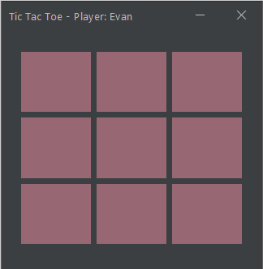

# TicTacToe - Programming Fundamental

## Student Information
- **Name**: Robertus Evan Arya Prabaswara
- **Student ID**: 5026251186
- **Class**: A

## Project Description
Game Tic-Tac-Toe berbasis Java Swing dengan fitur login, statistik, dan Top 5 Scorers menggunakan database PostgreSQL.

## Features
- Login dengan database
- Bermain Tic-Tac-Toe melawan komputer
- Rekam statistik (win/lose/draw/score)
- Lihat statistik pribadi
- Top 5 Scorers dengan JTable

## Database
- PostgreSQL
- Satu tabel: `players`

## How to Run
1. Buat database PostgreSQL
2. Jalankan `database/schema.sql`
3. Konfigurasi `DatabaseManager.java` (URL, username, password)
4. Jalankan `Main.java`

## Video Demo
[Link YouTube akan diisi]

## Screenshots

